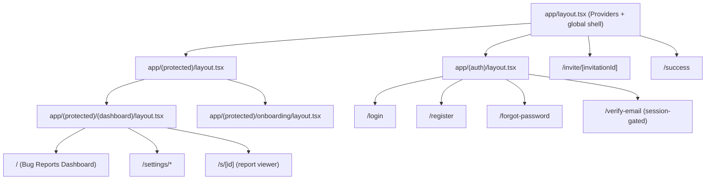
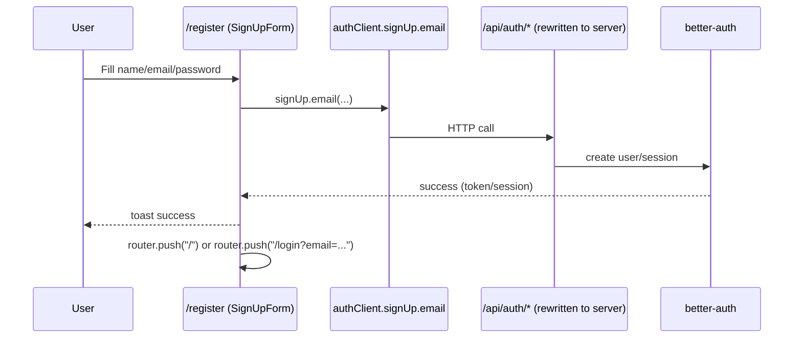
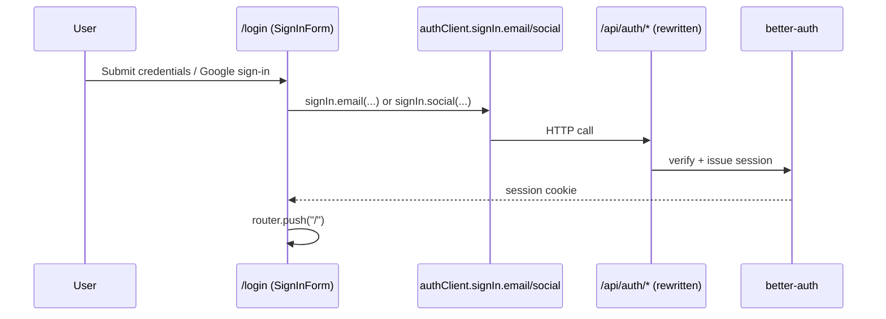
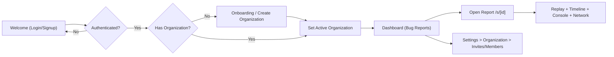

# Crikket Frontend Architecture Report

This document maps how the Crikket frontend UI is structured and how users flow through the app, based on code in `C:\Users\kkjay\Documents\sheshi\crikket`.

---

## 1) Routing & App Structure

Crikket uses **Next.js App Router** with route groups and layered layouts.

### High-Level Route Tree

### Public vs Protected Routes

- **Public routes**
  - `/login`, `/register`, `/forgot-password`
  - `/s/[id]` (shareable bug report page)
  - `/invite/[invitationId]` (client flow can redirect to login with callback)
- **Conditionally gated public routes**
  - `/verify-email` redirects to `/login` if no session and to `/` if already verified
  - `/success` requires session + checkout params, otherwise redirects appropriately
- **Protected routes** (under `app/(protected)`)
  - `/` (dashboard)
  - `/onboarding`
  - `/settings`, `/settings/user`, `/settings/organization`, `/settings/keys`, `/settings/billing`

### Layout Wrappers & Responsibilities

- `app/layout.tsx`
  - Global providers (`NuqsAdapter`, theme, React Query, tooltips, toaster)
- `app/(auth)/layout.tsx`
  - Auth page presentation shell
- `app/(protected)/layout.tsx`
  - Primary auth guard (`redirect("/login")` when no session)
- `app/(protected)/(dashboard)/layout.tsx`
  - Dashboard shell + sidebar/topbar
  - Enforces onboarding redirect when user has no organizations
- `app/(protected)/onboarding/layout.tsx`
  - Inverse guard: if user already has orgs, redirect to `/`

**Important:** There is **no `middleware.ts`** route guard in this repo. Protection is enforced in layouts/pages and API procedure middleware.

---

## 2) Authentication Flow

Auth is powered by **better-auth** (`packages/auth`) and consumed in web via `authClient`.

### Sign Up Journey

### Sign In Journey

### Session / Token Management

- Session is managed primarily via **HTTP-only cookies** configured by better-auth.
- Client uses:
  - `authClient.useSession()` for reactive session state
  - `authClient.getSession()` in server-side contexts with forwarded headers
- ORPC requests include credentials:
  - `fetch(..., { credentials: "include" })` in `apps/web/src/utils/orpc.ts`

### How Protected Routes Are Enforced

- **Page-level protection:** `redirect("/login")` in protected layouts/pages.
- **Organization gating:** dashboard layout redirects to `/onboarding` when no organizations.
- **API-level protection:** ORPC `protectedProcedure` throws `UNAUTHORIZED` when session is absent.

---

## 3) Core User Journeys (Happy Paths)

## A) Main Dashboard Flow

1. User reaches `/` (protected).
2. `getProtectedAuthData()` resolves session + org list.
3. Layout ensures:
   - logged in
   - has organization (else `/onboarding`)
4. Sidebar (`app-sidebar.tsx`) is rendered.
5. Bug reports list loads in dashboard page components.
6. User can filter/search/paginate and open report detail.

Key files:
- `apps/web/src/app/(protected)/(dashboard)/layout.tsx`
- `apps/web/src/app/(protected)/(dashboard)/page.tsx`
- `apps/web/src/components/app-sidebar.tsx`
- `apps/web/src/app/(protected)/(dashboard)/_components/bug-reports/*`

## B) View Specific Bug Report (Replay + Logs + Network)

Route: `/s/[id]`

1. Page resolves report id and loads `BugReportView`.
2. Main report query fetches report data.
3. Tab-specific lazy queries load when opened:
   - debugger/timeline events
   - network requests (including payload details on selection)
4. Video/screenshot canvas renders replay content.
5. Timeline / steps / console / network panels stay synchronized with selected entry and playback time.

Key files:
- `apps/web/src/app/s/[id]/page.tsx`
- `apps/web/src/app/s/[id]/_components/bug-report-view.tsx`
- `apps/web/src/app/s/[id]/_components/bug-report-canvas.tsx`
- `apps/web/src/app/s/[id]/_components/bug-report-sidebar.tsx`
- `apps/web/src/app/s/[id]/_components/network-requests-panel/*`

## C) Workspace / Organization / Invite Management

1. User creates org (dialog or onboarding form).
2. Active org is switched/persisted.
3. Settings organization page shows members + invites.
4. User can invite member, change role, remove member, cancel invite.
5. Invite link flow (`/invite/[invitationId]`) supports accept/reject and org activation.

Key files:
- `apps/web/src/components/team-switcher.tsx`
- `apps/web/src/components/create-organization-dialog.tsx`
- `apps/web/src/app/(protected)/onboarding/_components/create-organization-onboarding-form.tsx`
- `apps/web/src/app/(protected)/(dashboard)/settings/organization/page.tsx`
- `apps/web/src/app/(protected)/(dashboard)/settings/_components/org-members/*`
- `apps/web/src/app/invite/[invitationId]/*`

---

## 4) State Management & Data Fetching

### Data Fetching Stack

- Primary: **ORPC + TanStack Query**
  - `@orpc/tanstack-query`
  - `@tanstack/react-query`
- Server-side data (RSC) for protected/session bootstrap and settings composition.
- Client-side query/mutation for interactive parts (lists, filters, mutations, infinite scroll).
- URL state via **nuqs** for tab/search/filter persistence in query params.

### Global State Patterns

- No heavy centralized store (no major Zustand/Redux usage pattern in main frontend path).
- State strategy is layered:
  - **Auth/session**: better-auth client + server checks
  - **Remote cache**: React Query
  - **URL-synced UI state**: nuqs
  - **Local preference persistence**: local storage hooks (e.g., preferred org)
  - **Local component state**: forms/modals/selection states

---

## 5) Component Architecture & Design System

### Shared UI Primitives

- Shared UI package: `packages/ui`
- Includes `components/ui/*` primitives (buttons, cards, menus, sidebar, etc.).
- Built with class-variance patterns and utility classes; strong shadcn-style structure.

### Design System Summary

- **Tailwind CSS** (tokenized via CSS variables in shared styles)
- **Shadcn-style component organization**
  - `components.json` exists in `packages/ui`
- Uses modern headless primitives (`@base-ui/react` in many components)
- Motion/animation present through `motion` in selected visual components; not heavy across all core flows.

Key files:
- `packages/ui/package.json`
- `packages/ui/components.json`
- `packages/ui/src/components/ui/*`
- `packages/ui/src/styles/globals.css`
- `packages/ui/src/styles/dashboard.css`
- `apps/web/postcss.config.mjs`

---

## Auth + App Flow Blueprint (Migration Reference)

---

## Practical Notes For Spotting Migration

- Preserve this exact sequence:
  1. `Welcome -> Sign In/Sign Up`
  2. `Organization selection/creation`
  3. `Dashboard`
- Use layout-based route guards (like Crikket) for clean separation.
- Keep data and auth enforcement on both:
  - UI route/layout level
  - API procedure level
- Keep report detail modular with tab-lazy data loading (especially network/log payloads).

