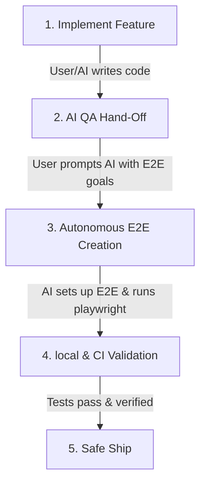

# AI-Driven QA & Test Engineering Workflow

Since you do not have a dedicated manual/QA test engineering team, you can delegate 100% of your testing, quality assurance, and verification responsibilities to **Antigravity (your AI Coding & QA Agent)**. 

This document defines the official **AI Test Engineer Protocol** for Spotting, outlining how to collaborate with AI to maintain high test coverage, author robust E2E browser tests, and ensure zero regressions.

---

## 1. The AI Test Engineer Core Functions

Antigravity operates as your **Senior QA & Test Engineer**, capable of:
*   **E2E Test Creation**: Setting up browser automation frameworks (Playwright) and writing user-journey test suites.
*   **Unit & Integration Test Coverage**: Automatically finding untested logic/endpoints and writing comprehensive unit tests.
*   **Test Data Provisioning**: Designing deterministic mock fixtures and database seeds.
*   **CI/CD Guarding**: Integrating checks into your local environments (`act`) and remote GitHub Action pipelines.
*   **Regression Rectification**: Analyzing broken tests, diagnosing failures (logs, traces), and applying surgical code fixes.

---

## 2. The AI-Driven QA Workflow

Integrate AI testing seamlessly into your development cycle using this standard three-step workflow:

### Step 1: Feature Hand-off to the AI Test Engineer
Whenever you or the AI finishes implementing a feature (e.g., *a new Invite Acceptance modal*), request test coverage by handing off the task to the AI.
> **Example Prompt:**
> *"AI Test Engineer: I just added a new Invite Acceptance modal in the web dashboard. Please write a Playwright E2E test file covering the full user flow (Sign In -> View Invites -> Accept Invite -> Verify redirect to Org home). Make sure all tests compile and pass locally."*

### Step 2: Autonomous Test Generation & Verification
The AI agent will:
1. Identify the routes, selectors, and API endpoints involved in the flow.
2. Write a highly resilient, selector-safe Playwright E2E test.
3. Launch a local dev server of the app, run the tests, capture any failures, and iteratively debug them until they pass.

### Step 3: CI/CD Guardrail
Once the AI test passes locally, it gets committed to the repository. The GitHub Actions CI workflow runs automatically on every pull request to enforce this new quality gate.

---

## 3. Playwright E2E Testing Protocol

To enable full E2E visual and functional testing, we configure Playwright inside `@spotting/web`:

*   **Tests Directory**: `apps/web/e2e/` (keeps tests modularized under the frontend package).
*   **Local E2E Command**: `npm run test:e2e` (spins up the API and Web servers, runs headless browser instances, and shuts down gracefully).
*   **CI Execution**: The GitHub Actions runner executes `npx playwright test` automatically during CI runs since the config file is present.

---

## 4. Reusable "AI Test Engineer" Prompt Templates

Use these exact prompts to invoke the AI QA engine during different phases of the project:

### 📑 Prompt: Author E2E Tests for a New Feature
> *"AI Test Engineer: Act as a Senior QA. Review the changes in `[feature_file.tsx]`. Identify the key user interactions, and write a comprehensive Playwright E2E test file under `apps/web/e2e/`. Run the test suite locally against the dev server to verify that it is robust and does not contain flaky assertions."*

### 🧪 Prompt: Find & Fill Test Gaps (Integration/Unit)
> *"AI Test Engineer: Analyze the current test files in `apps/api/src/` and compare them against `apps/api/src/v1.ts`. Identify any missing edge cases, error handlers, or untested business logic. Write additional unit and integration tests to increase coverage to >90%."*

### 🛠️ Prompt: Debug Broken Tests
> *"AI Test Engineer: The test suite is failing with the following output: `[paste_test_error_here]`. Analyze the stack trace, locate the root cause (e.g., database connection issue, invalid selector, state leakage), fix both the tests and application code, and run the suite to confirm it is resolved."*

---

## 5. Next Execution Steps

To make this workflow fully operational, we will execute the following step:
1. **Initialize Playwright in `@spotting/web`**: Add dependencies, write a robust `playwright.config.ts`, and create the first E2E smoke test verifying the login screen.
