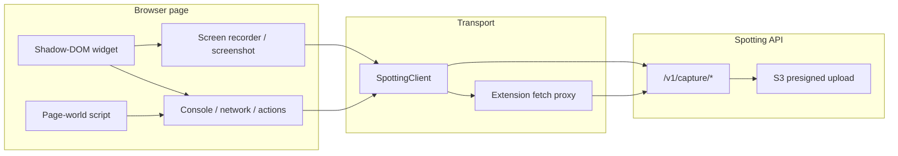

# Spotting capture pipeline

Formal attestation for the browser capture stack (`packages/sdk-js`, `apps/extension`, public capture API).  
**Implementation:** `packages/sdk-js/src/capture/`  
**Attestation:** No Crikket source used during Spotting capture reauthorship.

---

## Pipeline overview

| Stage | Module | Output |
|-------|--------|--------|
| Session | `capture-session.ts` | Start/end timestamps, duration |
| Console | `console-interceptor.ts`, `page-world-entry.ts` | Buffered console log entries |
| Network | `network-interceptor.ts`, `page-world-entry.ts` | Fetch/XHR metadata + bodies (truncated) |
| User actions | `user-actions.ts` | Clicks, navigation, popstate |
| Screenshot | `screenshot.ts` | PNG blob via canvas draw |
| Recording | `screen-recorder.ts` | WebM blob via MediaRecorder |
| Submit | `client.ts` | Report + metadata JSON + attachment upload |

---

## Standards & browser APIs (provenance)

Each capture feature is implemented against public web platform specifications — not third-party bug-report product code.

| Feature | Spotting module | Primary spec / API |
|---------|-----------------|-------------------|
| Screen recording | `screen-recorder.ts` | [Media Capture from DOM Elements](https://www.w3.org/TR/mediacapture-fdom/) — `navigator.mediaDevices.getDisplayMedia()` |
| Video encoding | `screen-recorder.ts` | [MediaStream Recording](https://www.w3.org/TR/mediastream-recording/) — `MediaRecorder`, `isTypeSupported()` |
| Screenshot frame | `screenshot.ts` | [HTML Canvas 2D Context](https://html.spec.whatwg.org/multipage/canvas.html) — `canvas.drawImage()`, `toBlob()` |
| Network (fetch) | `network-interceptor.ts` | [Fetch Standard](https://fetch.spec.whatwg.org/) — monkey-patched `window.fetch` |
| Network (XHR) | `page-world-entry.ts` | [XMLHttpRequest](https://xhr.spec.whatwg.org/) — `open`/`send` wrappers |
| Console | `console-interceptor.ts` | ECMAScript / browser console — wrapped `console.*` methods |
| User actions | `user-actions.ts` | [DOM Events](https://dom.spec.whatwg.org/) — `click`, `popstate` |
| Page metadata | `client.ts` | [HTML](https://html.spec.whatwg.org/) — `navigator.userAgent`, `window.innerWidth/Height`, `location.href` |
| Widget UI | `ui/widget.ts` | [DOM](https://dom.spec.whatwg.org/) + [Shadow DOM](https://dom.spec.whatwg.org/#shadow-trees) |
| Extension bridge | `capture/extension-fetch.ts` | [Chrome extension messaging](https://developer.chrome.com/docs/extensions/develop/concepts/messaging) |
| Upload | `client.ts` + API | [Fetch Standard](https://fetch.spec.whatwg.org/) — `PUT` to presigned S3 URL |

---

## Authentication

Public capture routes authenticate with **`Authorization: Bearer spk_live_…`**.

- Key format helpers: `packages/shared/src/constants/capture-keys.ts`
- API bearer validation: `apps/api/src/capture-public.ts`
- Legacy `crk_*` keys: see [docs/ops/capture-key-migration.md](../ops/capture-key-migration.md)

New integrations must use **`spk_` only** ([docs/clean-room-policy.md](../clean-room-policy.md)).

---

## Extension integration

The Chrome extension (`apps/extension`) injects `@spotting/sdk-js` via a content script. It does not reimplement capture logic — it mounts the same SDK widget and proxies API calls when mixed-content rules block page-origin fetch.

See [apps/extension/README.md](../../apps/extension/README.md).

---

## Related docs

- [docs/capture-embed.md](../capture-embed.md) — embed snippet
- [docs/ops/capture-key-migration.md](../ops/capture-key-migration.md) — production key migration
- [docs/api/openapi.yaml](../api/openapi.yaml) — `/v1/capture/*` routes
